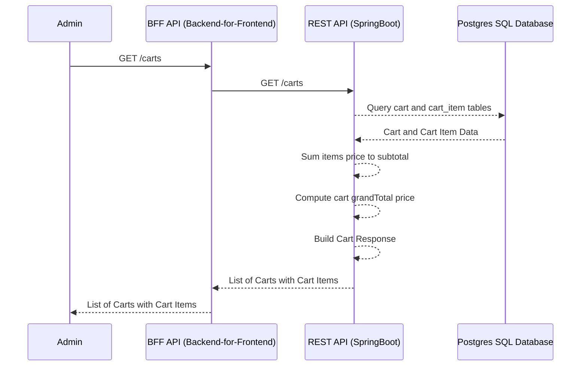
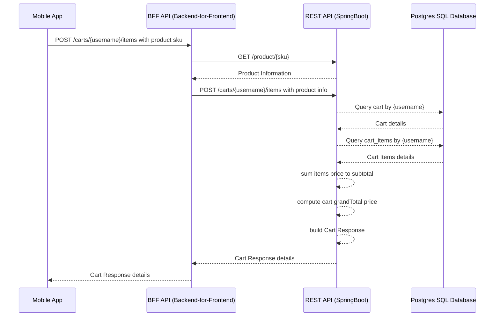
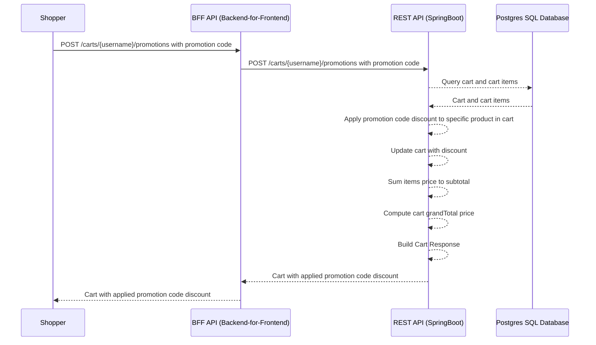
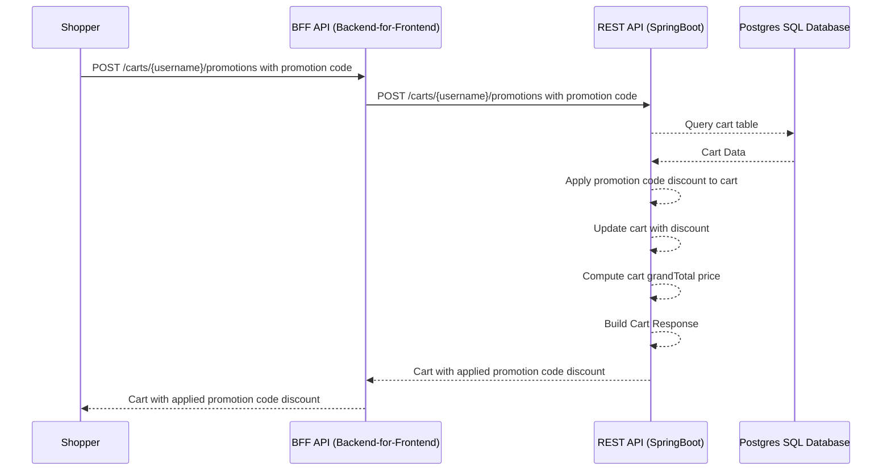

KBazaar - Online Shopping Application (Workshop)

Context:

KBazaar is a new online shopping platform aiming to provide a smooth and user-friendly experience for customers. This workshop will focus on implementing essential functionalities using REST APIs for the KBazaar server.

MVP Scope:
This workshop will focus on building the Minimum Viable Product (MVP) functionalities, prioritizing core features that deliver the most value to customers. This includes:

Products: Customers can browse and view product details which is associated with Shop
Carts: Customers can add and remove items to their carts.
Promotions: Customers can apply promotional codes to their carts.
- Promotion could be a percentage discount or a fixed amount discount.
- Promotion could be applied to the entire cart or specific products.
- Promotion could be Buy 2 Get 1 Free or Buy 3 Get 1 Free
Kpoints: Customers can earn Kpoints for every purchase and redeem them for discounts.
- Kpoints could be earned based on the amount spent.
- Kpoints could be redeemed for a discount on the next purchase.
- Kpoints could be used to get a free product.
- Kpoints could be used to get a discount on the entire cart.

Requirements: Consist with user stories and acceptance criteria as well as technical requirements.
REST API Endpoints: could be /products, /carts, /promotions, /kpoints
assume we have fix user id for now, so we can use /carts/{username} to get the cart of the user


User Stories:
# Story 1:

As a Shopper, I want to view a list of available products, so that I can browse and select the products I want to purchase.

## Acceptance Criteria:
- The API retrieves a list of all products
- Each product object includes essential details like id, name, description, price, sku and stock quantity.

## Technical Requirements:
- REST API Endpoint: GET /products
- Response: 200 OK with a list of products in JSON format
- Each product object should include id, name, description, price, sku and stock quantity.
- any error should be handled and return 404 Not Found with an appropriate error message if the product doesn't exist.
		for example: {"message": "Product not found"} with 404 status code


# Story 2:

As a Shopper, I want to view details of a specific product by its SKU, so that I can get more information about the product before making a purchase.

## Acceptance Criteria:
- The API retrieves details of a specific product based on the provided SKU.
- Returns a 200 OK with the product details if found.
- Returns a 404 Not Found with an appropriate error message if the product doesn't exist.

## Technical Requirements:
- REST API Endpoint: GET /products/{sku}
- Path Variable: {sku} - Represents the unique product identifier.
- Response: 200 OK with the product details in JSON format if found
- Response: 404 Not Found with an appropriate error message if the product doesn't exist
- any error should be handled and return 404 Not Found with an appropriate error message if the product doesn't exist.
		for example: {"message": "Product not found"} with 404 status code

# Story 3:

As a Product Manager, I want to have pagination for the products, so that I can manage the products more efficiently.

## Acceptance Criteria:
- The API retrieves a list of all products with pagination.
- Each product object includes essential details like id, name, description, price, sku and stock quantity.
- The API supports pagination with query parameters like page and limit.

## Technical Requirements:
- REST API Endpoint: GET /products with query parameters
- Query Parameters: page, limit
- Response: 200 OK with a list of products in JSON format
- Each product object should include id, name, description, price, sku and stock quantity.
- The API should support pagination based on the query parameters.

# Story 4:

As an Admin, I want to see list of carts, so that I can manage the carts more efficiently.

## Acceptance Criteria:
- The API retrieves a list of all carts
- Each cart object includes essential details like username, items, total price, total discount and total amount.

## Technical Requirements:
- REST API Endpoint: GET /carts
- Response: 200 OK with a list of carts in JSON format
- Each cart object should include username, items, total price, total discount and total amount.
- any error should be handled and return 404 Not Found with an appropriate error message if the cart doesn't exist.
		for example: {"message": "Cart not found"} with 404 status code

# Story 5:

As a Shopper, I want to add a specific product to my cart, so that I can purchase the product later.

## Acceptance Criteria:
- The API adds the specified product (identified by its SKU) to the user's cart with the provided quantity.
- Returns a 201 Created with a success message if the item is added successfully.
- Returns a 400 Bad Request with an appropriate error message if the request body is invalid (e.g., missing fields or invalid data format).

## Technical Requirements:
- REST API Endpoint: POST /carts/{username}/items
- Path Variable: {username} - Represents the unique user identifier.
- Request Body: Content Type: application/json
- Request Body Example: {"productSku": 1, "quantity": 2}
- Response: 201 Created with a success message if the item is added successfully
- Response: 400 Bad Request with an appropriate error message if the request body is invalid
- any error should be handled and return 400 Bad Request with an appropriate error message if the request body is invalid.
		for example: {"message": "Invalid request body"} with 400 status code

## Assumption:
	- BFF (Backend for frontend) will handle the stock quantity of the product as well as product information.
	- User will be have a cart when they create a user account.

## Out of Scope:
- The API does not validate the stock quantity of the product.
- The API does not handle the case where the product does not exist.
- The API does not handle the case where the user does not exist.
- The API does not handle the removal of a product from the cart.


# Story 6:

As a Shopper, I want to apply a *promotion code discount* to *specific product* in my cart, so that I can get a discount on my purchase.

## Acceptance Criteria:
- The API applies the promotion code `FIXEDAMOUNT2` discount to the specific product sku `STATIONERY-STAPLER-SWINGLINE` in the shopper cart.
- The promotion code can be applied once at a time.
- Returns a 200 OK with the updated cart details if the promotion code is applied successfully.

## Technical Requirements:
- REST API Endpoint: POST /carts/{username}/promotions
- Path Variable: {username} - Represents the unique user identifier.
- Request Body: Content Type: application/json
- Request Body Example: {"code": "FIXEDAMOUNT2", "productSkus": ["STATIONERY-STAPLER-SWINGLINE"]}


# Story 7:

As a Shopper, I want to apply a *promotion code discount* to *my cart*, so that I can get a discount on my purchase.

## Acceptance Criteria:
- The API applies the promotion code `FIXEDAMOUNT10` discount to the shopper cart.
- The promotion code can be applied once at a time.
- Returns a 200 OK with the updated cart details if the promotion code is applied successfully.

## Technical Requirements:
- REST API Endpoint: POST /carts/{username}/promotions
- Path Variable: {username} - Represents the unique user identifier.
- Request Body: Content Type: application/json
- Request Body Example: {"code": "FIXEDAMOUNT10"}

## Assumption:
- BFF (Backend for frontend) will handle the promotion code validation if the promotion code is valid or not.
- BFF will call the promotion endpoint only if the promotion code is valid.

# Story 8:

As a Product Owner, I want to limit the discount amount when shopper apply promotion code to the cart, so that I can control the discount amount.

## Acceptance Criteria:
- The API applies the promotion code `THIRTYPERCENTOFFLIMIT200` 30% Discount Up to 200 Baht Off Entire Cart discount to the shopper cart.
- Returns a 200 OK with the updated cart details if the promotion code is applied successfully.

## Technical Requirements:
- REST API Endpoint: POST /carts/{username}/promotions
- Path Variable: {username} - Represents the unique user identifier.
- Request Body: Content Type: application/json
- Request Body Example: {"code": "THIRTYPERCENTOFFLIMIT200"}

# Story 9:

As a Shopper, I want to apply a promotional code to get free product, so that I can get a free item on my purchase.

## Acceptance Criteria:
- The API applies the promotional code `BUY2GET1FREE` to the shopper cart.
- Returns a 200 OK with the updated cart details if the promotional code is applied successfully.

## Technical Requirements:
- REST API Endpoint: POST /carts/{username}/promotions
- Path Variable: {username} - Represents the unique user identifier.
- Request Body: Content Type: application/json
- Request Body Example: {"code": "BUY2GET1FREE"}

# Story 10:

As a Shopper, I want to apply a promotional code to specific product to get discount, so that I can get a discount on my purchase.

## Acceptance Criteria:
- The API applies the promotional code `SPECIFICPRODUCT30OFF` to the specific product sku `MOBILE-APPLE-IPHONE-12-PRO` in the shopper cart.

## Technical Requirements:
- REST API Endpoint: POST /carts/{username}/promotions
- Path Variable: {username} - Represents the unique user identifier.
- Request Body: Content Type: application/json
- Request Body Example: {"code": "SPECIFICPRODUCT30OFF", "productSkus": ["MOBILE-APPLE-IPHONE-12-PRO"]}

# Story 11:
As a Shopper, I want to to have a promotion applied to a product automatically, so that I can get a discount on my purchase.

## Acceptance Criteria:
- The API applies the promotion code discount to the product sku `MOBILE-APPLE-IPHONE-12-PRO` in the shopper cart.
- Returns a 200 OK with the updated cart details if the promotion code is applied successfully.

## Technical Requirements:
- REST API Endpoint: POST /carts/{username}/promotions
- Path Variable: {username} - Represents the unique user identifier.
- Request Body: Content Type: application/json
- Request Body Example: {"productSku": "MOBILE-APPLE-IPHONE-12-PRO"}

# Story 12:

As a Shopper, I want to earn Kpoints for every purchase, so that I can redeem them for discounts on my next purchase.

## Acceptance Criteria:
- The API calculates and adds Kpoints to the user's account based on the amount spent.
- Returns a 200 OK with the updated Kpoints balance if the Kpoints are added successfully.
- Returns a 400 Bad Request with an appropriate error message if the request body is invalid (e.g., missing fields or invalid data format).

## Technical Requirements:
- REST API Endpoint: POST /kpoints/{username}/earn
- Path Variable: {username} - Represents the unique user identifier.
- Request Body: Content Type: application/json
- Request Body Example: {"amount_spent": 100.00}
- Response: 200 OK with the updated Kpoints balance if the Kpoints are added successfully
- Response: 400 Bad Request with an appropriate error message if the request body is invalid
- any error should be handled and return 400 Bad Request with an appropriate error message if the request body is invalid.
		for example: {"message": "Invalid request body"} with 400 status code

# Story 13:

As a Shopper, I want to redeem Kpoints for a discount on my next purchase, so that I can save money on my order.

## Acceptance Criteria:
- The API applies the Kpoints discount to the user's cart based on the number of Kpoints redeemed.
- Returns a 200 OK with the updated cart details if the Kpoints are redeemed successfully.
- Returns a 404 Not Found with an appropriate error message if the Kpoints are insufficient or invalid.

## Technical Requirements:
- REST API Endpoint: POST /carts/{username}/kpoints
- Path Variable: {username} - Represents the unique user identifier.
- Request Body: Content Type: application/json
- Request Body Example: {"kpoints": 100}
- Response: 200 OK with the updated cart details if the Kpoints are redeemed successfully
- Response: 404 Not Found with an appropriate error message if the Kpoints are insufficient or invalid
- any error should be handled and return 404 Not Found with an appropriate error message if the Kpoints are insufficient or invalid.
		for example: {"message": "Insufficient Kpoints"} with 404 status code

# Story 14:

As a Shopper, I want to remove a specific product from my cart, so that I can update my purchase before checking out.

## Acceptance Criteria:
- The API removes the specified product (identified by its ID) from the user's cart.
- Any promotional discounts or Kpoints associated with the removed product should be recalculated and updated.
- Returns a 200 OK with a success message if the item is removed successfully.
- Returns a 404 Not Found with an appropriate error message if the product doesn't exist in the cart.

## Technical Requirements:
- REST API Endpoint: DELETE /carts/{username}/items/{productSku}
- Path Variable: {username} - Represents the unique user identifier.
- Path Variable: {productSku} - Represents the unique product identifier.
- Response: 200 OK with a success message if the item is removed successfully
- Response: 404 Not Found with an appropriate error message if the product doesn't exist in the cart
- any error should be handled and return 404 Not Found with an appropriate error message if the product doesn't exist in the cart.
		for example: {"message": "Product not found in the cart"} with 404 status code

# Story 15:

As a Shopper, I want to view my cart details, so that I can review the products and discounts before checking out.

## Acceptance Criteria:
- The API retrieves the user's cart details including products, quantities, prices, discounts, and total amount.
- Returns a 200 OK with the cart details in JSON format if the cart exists.
- Returns a 404 Not Found with an appropriate error message if the cart doesn't exist.

## Technical Requirements:
- REST API Endpoint: GET /carts/{username}
- Path Variable: {username} - Represents the unique user identifier.
- Response: 200 OK with the cart details in JSON format if the cart exists
- Response: 404 Not Found with an appropriate error message if the cart doesn't exist
- any error should be handled and return 404 Not Found with an appropriate error message if the cart doesn't exist.
		for example: {"message": "Cart not found"} with 404 status code

# Story 16:

As a Shopper, I want to place an order with the items in my cart, so that I can complete my purchase.

## Acceptance Criteria:
- The API creates an order with the items in the user's cart and updates the stock quantity of the products.
- Returns a 201 Created with the order details if the order is placed successfully.
- Returns a 400 Bad Request with an appropriate error message if the cart is empty or the stock quantity is insufficient.

## Technical Requirements:
- REST API Endpoint: POST /orders/{username}
- Path Variable: {username} - Represents the unique user identifier.
- Response: 201 Created with the order details if the order is placed successfully
- Response: 400 Bad Request with an appropriate error message if the cart is empty or the stock quantity is insufficient
- any error should be handled and return 400 Bad Request with an appropriate error message if the cart is empty or the stock quantity is insufficient.
		for example: {"message": "Cart is empty"} with 400 status code

# Story 17:

As a Product Owner I want to be able to charge shopping fee for the order in next 3 months, so that I can cover the delivery cost.

## Acceptance Criteria:
- The API charges a shopping fee of 25 Baht for the order in the next 3 months.
- I want to show the shopping fee in the cart details and order details.
- Returns a 200 OK with the updated order details if the shopping fee is applied successfully.

## Technical Requirements:
- REST API Endpoint: POST /carts/{username}/items
- Path Variable: {username} - Represents the unique user identifier.
- Request Body: Content Type: application/json
- Request Body Example: {"productSku": 1, "quantity": 2}
- Response: 200 OK with the updated order details if the shopping fee is applied successfully


<!-- Hints: collapse -->
## Some hints to help the participants get started with the workshop.
<details>
  <summary>Technical hints: อย่าพึ่งเปิดให้คิดเองก่อน</summary>

1. Get Products (GET /products):

- Description: Retrieves a list of available products.
- Response:
- Status Code: 200 OK
- Content Type: application/json
- Example Payload:

```json
[
  {
    "id": 1,
    "name": "T-Shirt",
    "description": "A comfortable and stylish T-shirt",
    "price": 19.99,
    "image_url": "https://example.com/tshirt.jpg"
  },
  {
    "id": 2,
    "name": "Mug",
    "description": "A beautiful mug for your morning coffee",
    "price": 9.99,
    "image_url": "https://example.com/mug.jpg"
  }
]
```

2. Get Product by ID (GET /products/{sku}):

- Description: Retrieves details of a specific product by its sku.
- Response:
- Status Code: 200 OK
- Content Type: application/json
- Example Payload:

```json
 {
    "id": 1,
    "name": "Apple iPhone 12 Pro",
    "sku": "MOBILE-APPLE-IPHONE-12-PRO",
    "price": 20990.25,
    "quantity": 50
  }
```

3. List Carts (GET /carts):

```sql
CREATE TABLE IF NOT EXISTS cart (
    id SERIAL PRIMARY KEY,
    username VARCHAR(255) NOT NULL,
    discount DECIMAL(10, 2) default 0.00,
    total_discount DECIMAL(10, 2) default 0.00,
    promotion_codes VARCHAR(255) default '', -- comma-separated list of promotion codes
    subtotal DECIMAL(10, 2) default 0.00,
    grand_total DECIMAL(10, 2) default 0.00
);
```

- Description: Retrieves a list of all carts.
- Response:
- Status Code: 200 OK
- Content Type: application/json
- Example Payload:

```json
[
	{
		"username": "TechNinja",
		"items": [
			{
				"id": 1,
				"username": "TechNinja",
				"sku": "MOBILE-APPLE-IPHONE-12-PRO",
				"name": "Apple iPhone 12 Pro",
				"price": 20990.25,
				"quantity": 1,
				"discount": 0,
				"promotionCodes": ""
			}
		],
		"discount": 0,
		"totalDiscount": 0,
		"subtotal": 1,
		"grandTotal": 1
	}
]
```

Diagram:


3. Add Product to Cart (POST /carts/{username}/items):

```sql
CREATE TABLE IF NOT EXISTS cart_item (
    id SERIAL PRIMARY KEY,
    username VARCHAR(255) NOT NULL,
    sku VARCHAR(255) NOT NULL default '',
    name VARCHAR(255) NOT NULL default '',
    price DECIMAL(10, 2) default 0.00,
    quantity INT NOT NULL default 0,
    discount DECIMAL(10, 2) default 0.00,
    promotion_codes VARCHAR(255) NOT NULL default '', -- comma-separated list of promotion codes
    UNIQUE (username, sku)
);
```

- Description: Adds a specific product to the user's cart.
- Request:
- Content Type: application/json
- Example Payload: POST /carts/TechNinja/items
```json
{
  "sku": "MOBILE-APPLE-IPHONE-12-PRO",
  "name": "Apple iPhone 12 Pro",
  "price": 20990.25,
  "quantity": 1,
  "discount": 0,
  "promotionCodes": ""
}
```

- Response:
- Status Code: 201 Created
- Content Type: application/json
- Example Payload:
```json
{
  "username": "TechNinja",
  "items": [
    {
      "id": 1,
      "username": "TechNinja",
      "sku": "MOBILE-APPLE-IPHONE-12-PRO",
      "name": "Apple iPhone 12 Pro",
      "price": 20990.25,
      "quantity": 1,
      "discount": 0,
      "promotionCodes": ""
    }
  ],
  "discount": 0,
  "totalDiscount": 0,
  "subtotal": 20990.25,
  "grandTotal": 20990.25,
  "promotionCodes": ""
}
```

Diagram:



4. Apply Promotion Code to Specific Product in Cart (POST /carts/{username}/promotions):

- Description: Applies a promotion code discount to a specific product in the user's cart.
- Request:
- Content Type: application/json
- Example Payload: POST /carts/TechNinja/promotions
```json
{
  "code": "FIXEDAMOUNT2",
  "name": "Fixed Amount $2 Off Specific Products",
  "description": "Get $2 off on specific products.",
  "startDate": "2024-03-25T10:30:00.000Z",
  "endDate": "2025-05-25T10:30:00.000Z",
  "discountType": "FIXED_AMOUNT",
  "discountAmount": 2.00,
  "applicableTo": "SPECIFIC_PRODUCTS",
  "productSkus": "STATIONERY-STAPLER-SWINGLINE,STATIONERY-PENCIL-FABER-CASTELL"
}
```

- Response:
- Status Code: 200 OK
- Content Type: application/json
- Example Payload:

```json
{
  "username": "TechNinja",
  "items": [
    {
      "id": 1,
      "username": "TechNinja",
      "sku": "STATIONERY-STAPLER-SWINGLINE",
      "name": "Staplers",
      "price": 20.25,
      "quantity": 1,
      "discount": 2,
      "promotionCodes": "FIXEDAMOUNT2"
    }
  ],
  "discount": 0,
  "totalDiscount": 2,
  "subtotal": 20.25,
  "grandTotal": 18.25,
  "promotionCodes": ""
}
```

Diagram:


4. Apply Promotion Code to Cart (POST /carts/{username}/promotions):

- Description: Applies a promotion code discount to the user's cart.
- Request:
- Content Type: application/json
- Example Payload: POST /carts/TechNinja/promotions
```json
{
  "code": "FIXEDAMOUNT10",
  "name": "Fixed Amount $10 Off Entire Cart",
  "description": "Get $10 off on your entire cart purchase.",
  "startDate": "2024-03-25T10:30:00.000Z",
  "endDate": "2025-05-25T10:30:00.000Z",
  "discountType": "FIXED_AMOUNT",
  "discountAmount": 10.00,
  "applicableTo": "ENTIRE_CART",
  "productSkus": ""
}
```

- Response:
- Status Code: 200 OK
- Content Type: application/json
- Example Payload:

```json
{
  "username": "TechNinja",
  "items": [
    {
      "id": 1,
      "username": "TechNinja",
      "sku": "MOBILE-APPLE-IPHONE-12-PRO",
      "name": "Apple iPhone 12 Pro",
      "price": 20990.25,
      "quantity": 1,
      "discount": 0,
      "promotionCodes": ""
    }
  ],
  "discount": 10,
  "totalDiscount": 10,
  "subtotal": 20990.25,
  "grandTotal": 20980.25,
  "promotionCodes": "FIXEDAMOUNT10"
}
```

Diagram:


6. Paginate Products (GET /products):

- Description: Retrieves a list of all products with pagination.
- https://docs.gitlab.com/ee/api/rest/index.html#offset-based-pagination
-
- Query Parameters: page, per_page
- Example: GET /products?page=1&per_page=10
- Response:
- Status Code: 200 OK
- Content Type: application/json
- Example:
```json
[
	{
		"id": 1,
		"name": "T-Shirt",
		"description": "A comfortable and stylish T-shirt",
		"price": 19.99,
		"image_url": "https://example.com/tshirt.jpg"
	},
	{
		"id": 2,
		"name": "Mug",
		"description": "A beautiful mug for your morning coffee",
		"price": 9.99,
		"image_url": "https://example.com/mug.jpg"
	}
]
```

```
Headers:
Content-Type: application/json
x-next-page: 3
x-page: 2
x-per-page: 3
x-prev-page: 1
x-total: 10
x-total-pages: 3
```

</details>
